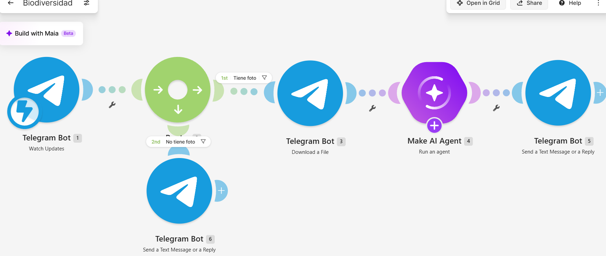
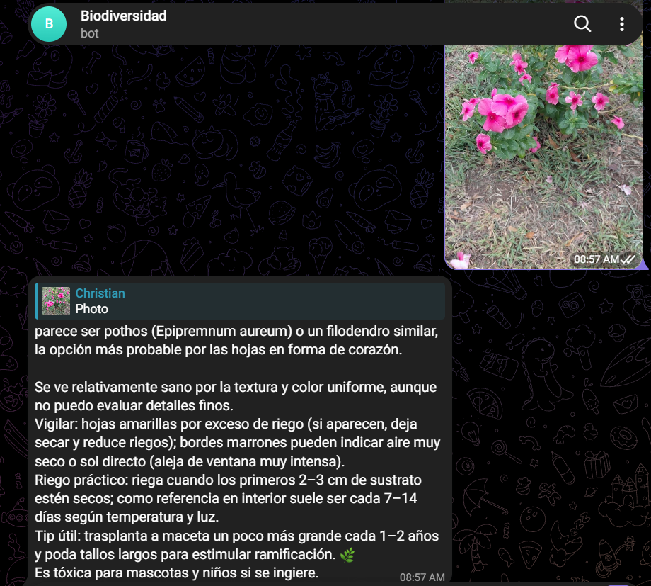
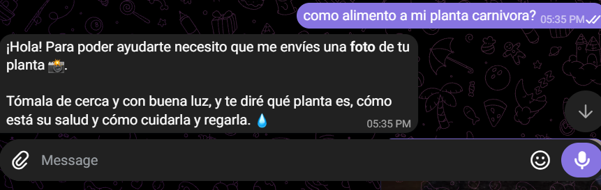

# Biodiversidad

**Materia:** Desarrollo Sustentable · 3er semestre
**Carrera:** Ingeniería en Sistemas Computacionales — Instituto Tecnológico de Mazatlán
**Profesor:** Miguel Ángel Barrón Hernández
**Alumno:** Christian Paul Lizárraga Oronia

---

## 1. Descripción del proyecto

Se construyó un escenario de automatización en **Make.com** llamado **"Biodiversidad"** que conecta un **bot de Telegram** con un **agente de inteligencia artificial**. Cualquier estudiante puede enviar al bot una foto de una planta del jardín del plantel y recibe, en segundos, una respuesta con:

- Nombre común y nombre científico de la planta.
- Estado de salud aparente.
- Problemas a vigilar (plagas, manchas, hojas amarillas) y qué hacer.
- Recomendación de riego (regla del sustrato seco).
- Aviso si la planta es tóxica para personas o mascotas.

El objetivo es **acercar la biodiversidad del campus a la comunidad estudiantil**: conocer qué especies tenemos, cuidarlas mejor y generar interés por conservarlas.

## 2. Estructura del repositorio

```
├── README.md                 ← este reporte técnico
├── codigo/
│   └── blueprint.json        ← exportación del escenario de Make.com
├── imagenes/
│   ├── escenario_completo.png
│   ├── prueba_foto_planta.png
│   └── prueba_sin_foto.png
├── video/
│   ├── enlace.txt            ← link de YouTube con la prueba en vivo
│   └── enlace.md             ← mismo link, clickeable
└── resultados/
    └── Resultados_Biodiversidad.pdf
```

## 3. Arquitectura del escenario



| # | Módulo | Función |
|---|--------|---------|
| 1 | **Telegram Bot – Watch Updates** | Disparador instantáneo (webhook). Recibe cada mensaje que llega al bot. |
| 2 | **Router** | Divide el flujo en dos rutas según el contenido del mensaje. |
| 3 | **Telegram Bot – Download a File** | Descarga la foto en su mayor resolución (`last(map(1.message.photo; "file_id"))`). |
| 4 | **Make AI Agent – Run an agent** | Modelo `gpt-5-mini` con un *system prompt* de "botánico experto" que analiza la imagen. |
| 5 | **Telegram Bot – Send a Text Message or a Reply** | Responde al usuario citando su mensaje original con el análisis de la IA. |
| 6 | **Telegram Bot – Send a Text Message or a Reply** | Si no se envió foto, pide amablemente que se mande una. |

### Filtros

| Ruta | Nombre del filtro | Condición | Resultado |
|------|-------------------|-----------|-----------|
| 1st | **Tiene foto** | `1.message.photo` → *Exists* | Descarga la foto → IA → respuesta con la identificación |
| 2nd | **No tiene foto** | `1.message.photo` → *Does not exist* | Mensaje de ayuda: "envíame una foto de tu planta 📸" |

Los filtros son mutuamente excluyentes, así que cada mensaje sigue **solo una** ruta y no se gastan operaciones de IA en mensajes de texto.

### Configuración del agente de IA

- **Modelo:** GPT-5 mini (esfuerzo de razonamiento *bajo*, para respuestas rápidas).
- **Entrada:** la foto descargada (`planta.jpg`) + el comentario/pie de foto del usuario, si lo hay.
- **Instrucciones clave del prompt:**
  - Responder siempre en español, con tono cercano y máximo 200 palabras.
  - Si la foto no contiene plantas, responder con un mensaje de error claro.
  - Si no está seguro de la especie, decir "parece ser…" y **nunca inventar un nombre**.
  - Sin formato Markdown, porque el mensaje se envía como texto plano por Telegram.

## 4. Evidencias

**Ruta "Tiene foto":** se envía la foto de una planta y el bot responde con el análisis.



**Ruta "No tiene foto":** se envía solo texto y el bot pide una foto.



**Video de la prueba en vivo:** [▶️ Ver video en YouTube](https://youtube.com/shorts/o9HT8_l86RE)

## 5. Preguntas de reflexión

**1. ¿Qué problema de sustentabilidad atiende este proyecto?**
La pérdida de biodiversidad empieza por el desconocimiento: es difícil proteger lo que no sabemos que existe. El bot permite que cualquier persona identifique las especies del campus sin ser experta, y eso genera un inventario informal y conciencia sobre las plantas que nos rodean.

**2. ¿Con qué Objetivo de Desarrollo Sostenible se relaciona?**
Principalmente con el **ODS 15 – Vida de ecosistemas terrestres** (conservar la biodiversidad) y con el **ODS 4 – Educación de calidad**, porque es una herramienta de aprendizaje accesible desde el celular.

**3. ¿Qué ventajas tiene usar automatización e IA en este caso?**
La respuesta llega en segundos, está disponible las 24 horas y no requiere instalar ninguna app nueva (Telegram ya es común). Además, los filtros hacen que la IA solo se use cuando realmente hay una foto, lo que reduce el consumo de operaciones y de energía.

**4. ¿Cuáles son las limitaciones del sistema?**
La IA puede equivocarse con especies parecidas o con fotos borrosas o mal iluminadas. Por eso el prompt le pide indicar cuando no está segura en lugar de inventar. No sustituye a un botánico ni a una guía de campo, pero sí es un buen primer acercamiento.

**5. ¿Qué mejoras se podrían implementar?**
- Guardar cada identificación (especie, fecha, foto) en Google Sheets o en un Data Store para construir un **inventario de biodiversidad del campus**.
- Agregar la ubicación dentro del plantel para hacer un mapa de especies.
- Marcar las especies nativas e invasoras de Sinaloa para priorizar su cuidado.

**6. ¿Qué aprendí con esta práctica?**
Aprendí a diseñar un flujo con disparadores por webhook, a usar un **router con filtros** para separar casos, a manejar archivos (descargar la foto de Telegram y pasarla a la IA) y a escribir un *system prompt* con reglas claras. También entendí que la tecnología puede ser una herramienta directa para la educación ambiental.

## 6. Conclusión

El escenario "Biodiversidad" demuestra que con herramientas *no-code* como Make.com se puede crear en poco tiempo una solución útil que conecta la tecnología con el cuidado del medio ambiente. El bot convierte la curiosidad sobre una planta en una oportunidad de aprendizaje sobre la biodiversidad del campus.
